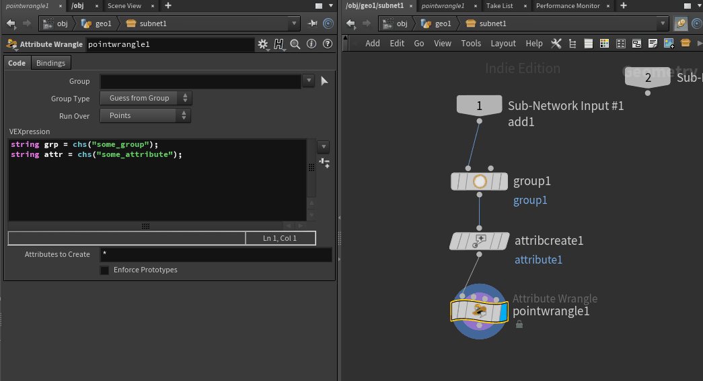

# hou-menus
Some additions to menus you could find useful.

Put the files in your preferences directory, which on Windows is typically in My Documents\houdiniXX.X. In OS X it's in ~Library/Preferences/Houdini.
Use with care. As for now, please insert the XML code into OPmenu.xml, PARMmenu.xml and ParmGearMenu.xml if they already exists.
